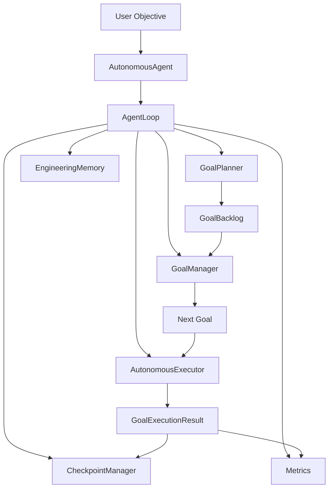
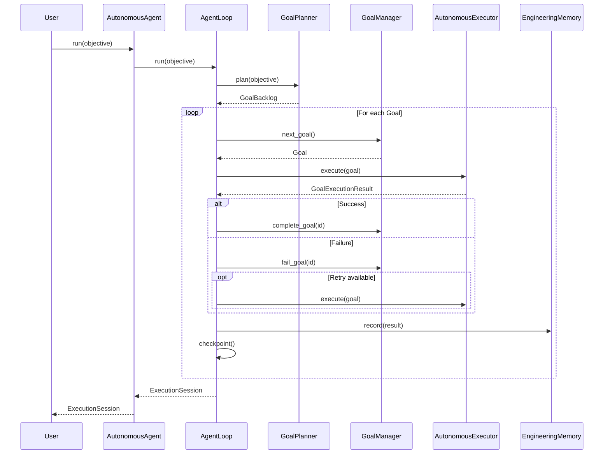
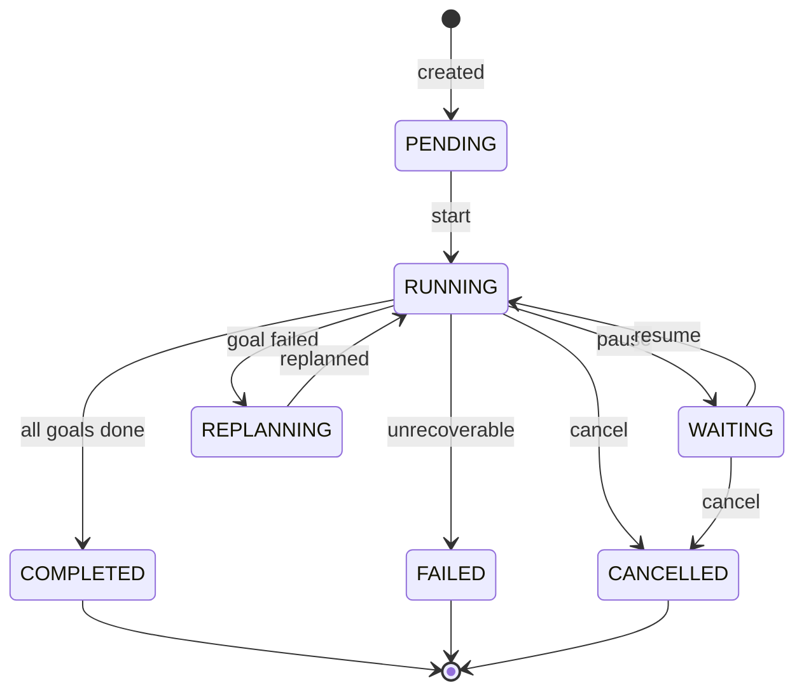

# Agent System — Sprint 4

## Overview

The Agent subsystem orchestrates the full autonomous loop: plan → execute → evaluate → repeat. It connects GoalPlanner, GoalManager, AutonomousExecutor, and EngineeringMemory into a deterministic, cancellable session.

## Architecture



### Agent Loop



### State Machine



## Component Reference

### AutonomousAgent

```python
class AutonomousAgent:
    def __init__(
        self,
        planner: GoalPlanner,
        goal_manager: GoalManager,
        executor: Any,
        memory: EngineeringMemory,
        event_bus: Optional[GoalEventBus] = None,
        retry_policy: Optional[RetryPolicy] = None,
        config: Optional[AgentConfiguration] = None,
    ) -> None
    def run(self, objective: str) -> ExecutionSession
    def cancel(self) -> None
    def pause(self) -> None
    def resume(self) -> None
    def stop(self) -> None
```

Public entry point. Accepts all dependencies via constructor (Dependency Injection). Delegates to `AgentLoop`.

### AgentLoop

```python
class AgentLoop:
    def __init__(self, context: AgentContext) -> None
    def run(self, objective: str) -> ExecutionSession
    def cancel(self) -> None
    def pause(self) -> None
    def resume(self) -> None
    def stop(self) -> None
    @property
    def metrics(self) -> AgentMetrics
    @property
    def is_cancelled(self) -> bool
```

Deterministic loop. No recursion. Iterates over backlog goals, executing each with retry support. Respects cancel/pause/resume.

### ExecutionSession

```python
@dataclass
class ExecutionSession:
    id: str
    objective: str
    created_at: datetime
    started_at: Optional[datetime]
    finished_at: Optional[datetime]
    state: ExecutionState
    current_goal: Optional[str]
    completed_goals: List[str]
    failed_goals: List[str]
    cancelled: bool
    results: List[GoalExecutionResult]
    metadata: Dict[str, Any]
```

### ExecutionState

| State | Description |
|-------|-------------|
| `PENDING` | Session created, not started |
| `RUNNING` | Actively executing goals |
| `WAITING` | Paused by user |
| `REPLANNING` | Re-planning after failure |
| `COMPLETED` | All goals done |
| `FAILED` | Unrecoverable error |
| `CANCELLED` | User cancelled |

### GoalExecutionResult

```python
@dataclass
class GoalExecutionResult:
    goal: Goal
    success: bool
    output: str
    duration: float
    errors: List[str]
    warnings: List[str]
    metadata: Dict[str, Any]
    requires_replan: bool
```

### RetryPolicy

```python
@dataclass
class RetryPolicy:
    max_retries: int = 3
    base_delay: float = 1.0
    max_delay: float = 60.0
    backoff_factor: float = 2.0
    retryable_errors: Tuple[Type[Exception], ...] = (Exception,)
    timeout: Optional[float] = None

    def compute_delay(self, attempt: int) -> float
    def is_retryable(self, error: Exception) -> bool
    def execute(self, fn, on_retry=None) -> object
```

### AgentContext

```python
@dataclass
class AgentContext:
    planner: GoalPlanner
    goal_manager: GoalManager
    executor: Any
    memory: EngineeringMemory
    event_bus: GoalEventBus
    retry_policy: RetryPolicy
    config: AgentConfiguration
    session: Optional[ExecutionSession]
    metadata: Dict[str, Any]
```

### AgentConfiguration

| Field | Default | Description |
|-------|---------|-------------|
| `max_goals` | `0` | Max goals per session (0 = unlimited) |
| `auto_replan` | `True` | Re-plan after failures |
| `checkpoint_enabled` | `False` | Save checkpoints |
| `checkpoint_dir` | `".checkpoints"` | Checkpoint directory |

### CheckpointManager

```python
class CheckpointManager:
    def save(self, session, backlog=None, extra=None) -> str
    def load(self, session_id) -> Optional[Dict[str, Any]]
    def delete(self, session_id) -> bool
```

### AgentMetrics

```python
@dataclass
class AgentMetrics:
    goals_completed: int
    goals_failed: int
    goals_skipped: int
    goals_retried: int
    replan_count: int
    total_duration: float
    execution_durations: List[float]

    @property
    def average_duration(self) -> float
    @property
    def total_goals(self) -> int
```

## Events

| Event | When |
|-------|------|
| `agent.session_started` | Session begins |
| `agent.session_finished` | Session ends |
| `agent.session_paused` | User pauses |
| `agent.session_resumed` | User resumes |
| `agent.session_cancelled` | User cancels |
| `agent.goal_started` | Goal execution starts |
| `agent.goal_finished` | Goal execution succeeds |
| `agent.goal_failed` | Goal execution fails |
| `agent.goal_retried` | Goal is retried |
| `agent.goal_skipped` | Goal is skipped |
| `agent.planner_started` | Planning begins |
| `agent.planner_finished` | Planning finishes |
| `agent.executor_started` | Executor runs |
| `agent.executor_finished` | Executor returns |

All events include `timestamp`, `event_type`, `goal_id` (or session_id), and metadata.

## Usage

```python
from clawai.agent import AutonomousAgent, RetryPolicy
from clawai.goals import GoalPlanner, GoalManager
from clawai.engineering import EngineeringMemory
from clawai.executor import AutonomousExecutor

planner = GoalPlanner(strategy="rule_based")
memory = EngineeringMemory()
gm = GoalManager(repository=memory)
executor = AutonomousExecutor(self_repair=..., editor=..., memory=memory)

agent = AutonomousAgent(
    planner=planner,
    goal_manager=gm,
    executor=executor,
    memory=memory,
    retry_policy=RetryPolicy(max_retries=2, base_delay=0.5),
)

session = agent.run("Fix login bug\nAdd input validation\nWrite tests")
print(f"Completed: {len(session.completed_goals)}, Failed: {len(session.failed_goals)}")
```

## Test Layout

| File | Tests | Scope |
|------|-------|-------|
| `test_agent.py` | 39 | All agent components + integration |
