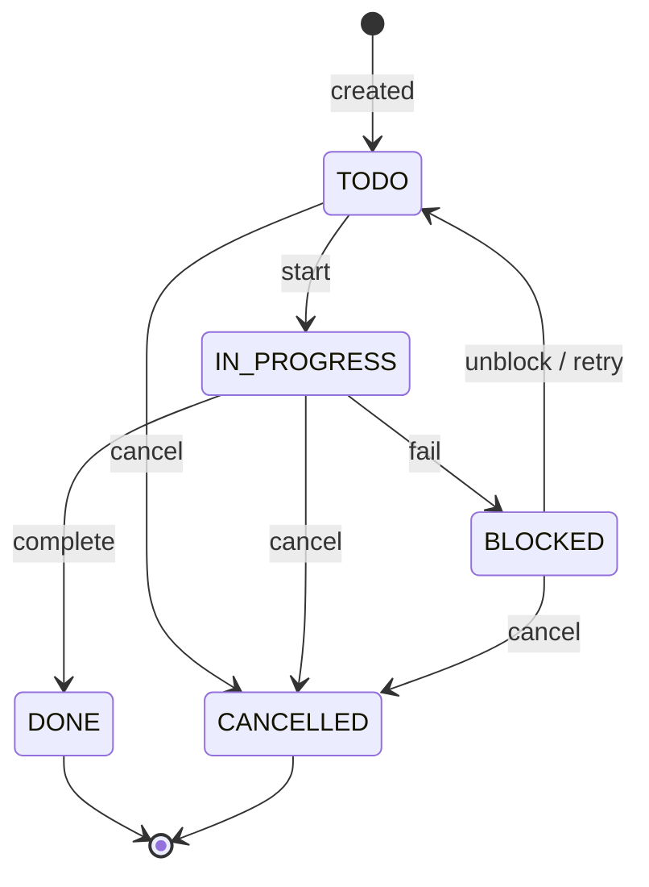
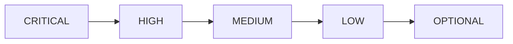
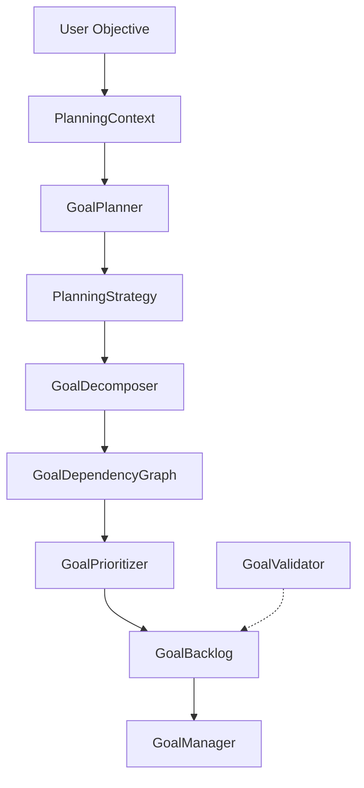
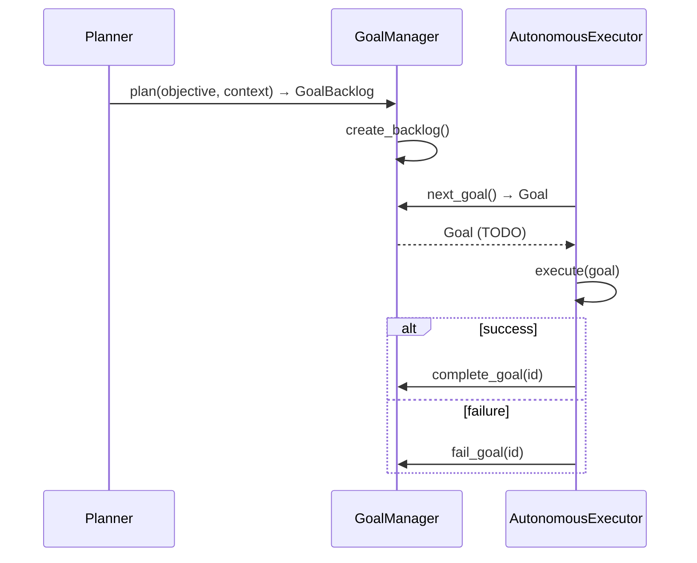

# Goal System — Architecture Overview

The Goal subsystem provides a deterministic, event-driven framework for defining, planning, tracking, and completing goals. It is designed to be **LLM-free** — all decisions are made via enums, rules, and explicit state transitions.

The goal system is consumed by the **Agent subsystem** ([`docs/agent.md`](../agent.md)) which orchestrates the full autonomous loop.

## Subsystem Map

```
┌──────────────┐     ┌────────────────┐     ┌──────────────────┐
│  GoalPlanner │ ──> │  GoalManager   │ ──> │ GoalRepository   │
│  (plan)      │     │  (orchestrate)  │     │ (ABC / adapter)  │
└──────────────┘     └───────┬────────┘     └──────────────────┘
                             │
                     ┌───────┴────────┐
                     │  GoalEventBus  │
                     │  (pub/sub)     │
                     └────────────────┘
                              │
                     ┌───────┴────────┐
                     │ AutonomousAgent│
                     │  (Sprint 4)    │
                     └────────────────┘
```

## Core Types

| Type | Source | Purpose |
|------|--------|---------|
| `Goal` | `goal.py` | Immutable dataclass — the core domain entity |
| `GoalStatus` | `goal_status.py` | Enum: `TODO`, `IN_PROGRESS`, `BLOCKED`, `DONE`, `CANCELLED` |
| `GoalPriority` | `goal_priority.py` | IntEnum: `CRITICAL(0)` … `OPTIONAL(4)` |
| `GoalProgress` | `goal_progress.py` | Snapshot of completion state |
| `GoalBacklog` | `goal_backlog.py` | Ordered snapshot of all goals at a point in time |
| `GoalEvent` | `goal_events.py` | Immutable event dataclass |
| `GoalEventBus` | `goal_events.py` | Publish / subscribe / emit / history |
| `GoalValidator` | `goal_validator.py` | `validate_goal()` with `ValidationError` |
| `GoalPlanner` | `goal_planner.py` | Splits an objective string into deterministic sub-goals |
| `GoalManager` | `goal_manager.py` | Main orchestration class |
| `GoalRepository` | `goal_repository.py` | Abstract persistence interface |
| `EngineeringMemoryGoalRepository` | `engineering_memory_goal_repository.py` | In-memory adapter |

### Domain Entity — Goal

```python
@dataclass(frozen=True)
class Goal:
    id: str
    title: str
    description: str
    success_criteria: str
    priority: GoalPriority | int
    status: GoalStatus | str
```

- **Frozen** — immutability guarantees safe sharing across threads
- **Backward-compatible** — accepts legacy `int` priority and `str` status values via `__post_init__` normalization
- **Validated on construction** — empty fields, invalid enums, and bool-as-priority raise `ValueError`
- Old-style constants remain importable:
  - `GOAL_STATUS_PENDING`, `GOAL_STATUS_RUNNING`, `GOAL_STATUS_COMPLETED`, `GOAL_STATUS_FAILED`, `GOAL_STATUS_CANCELLED`
  - `GOAL_PRIORITY_CRITICAL`, … `GOAL_PRIORITY_OPTIONAL`
  - `ALLOWED_STATUSES`

### Goal Lifecycle



All state transitions are driven by explicit `GoalManager` methods; no implicit transitions occur.

## Priority Ordering



Priority is an `IntEnum` where **lower values = higher urgency**. Sorting uses `(int(priority), title, id)`.

## Event-Driven Design

`GoalManager` emits events on every mutation:

| Event Constant | When Emitted |
|---------------|--------------|
| `goal.created` | Goal is added via `add_goal()` or discovered from memory |
| `goal.completed` | Goal reaches DONE or BLOCKED status |
| `goal.cancelled` | Goal is removed via `remove_goal()` |
| `goal.progress_updated` | Progress percentage is reported |

External consumers subscribe via `GoalEventBus.subscribe(event_type, handler)`.

## Planning Flow (Sprint 3)



## Integration with AutonomousExecutor



`AutonomousExecutor` **does not** import or reference `GoalManager` or `GoalPlanner`. Orchestration happens at a higher level, keeping the executor focused on task execution.
