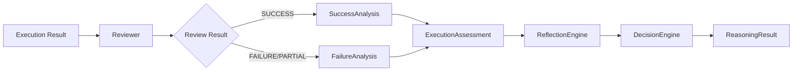
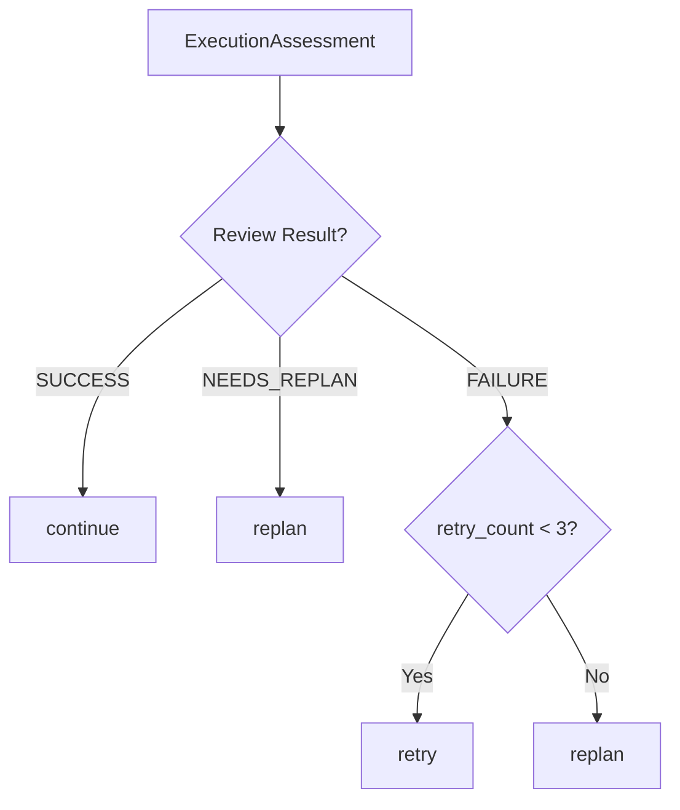
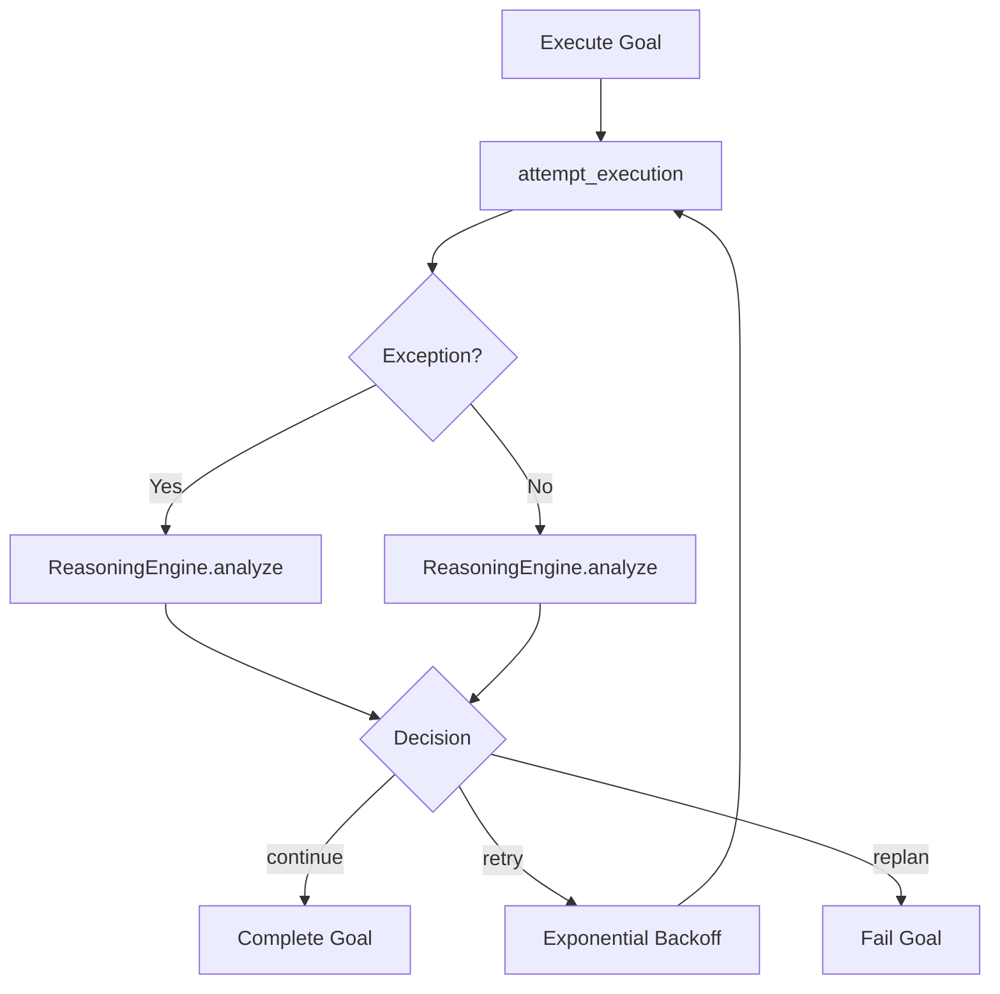

# Cognitive Layer (Sprint 5)

## Overview

The Cognitive Layer implements a deterministic, rule-based reasoning system for autonomous coding agents. Every execution decision passes through the cognitive layer before the agent acts on it.

## Architecture

The cognitive flow follows a strict pipeline:



## Components

### `ReviewResult` Enum
- `SUCCESS` — goal completed successfully
- `PARTIAL` — partial completion (e.g., long duration)
- `FAILURE` — execution failed
- `NEEDS_REPLAN` — requires plan revision
- `UNKNOWN` — cannot determine

### `AbstractReviewer` / `Reviewer`
Rule-based review analyzing execution success, errors, retry count, and duration.

```python
class AbstractReviewer(ABC):
    @abstractmethod
    def review(self, *, success, errors, warnings, output, duration, retry_count, metadata) -> ReviewResult: ...
```

### `FailureCategory` Enum
- `TOOL_FAILURE` — tool/editor/patch errors
- `VALIDATION_FAILURE` — validation/schema errors
- `PLANNING_FAILURE` — planning/objective errors
- `EXECUTION_FAILURE` — runtime errors
- `TIMEOUT` — timeout/deadline errors
- `DEPENDENCY_FAILURE` — import/missing dependency errors
- `UNKNOWN` — unclassified

### `FailureAnalysis`
Keyword-based classification of error messages into `FailureCategory`.

### `SuccessAnalysis` Data Class
Stores success metrics: duration, quality score, tests, files modified, impact, tokens, cost, recommendations.

### `ExecutionAssessment` Data Class
Aggregates goal execution data: success/failure, review result, failure category, errors, warnings, duration, retry count.

### `AbstractDecisionEngine` / `DecisionEngine`
Deterministic decision-making based on assessment:



### `ReflectionEngine`
Records `ReflectionEntry` objects in memory, supporting:
- Entry recording with optional `EngineeringMemory` persistence
- Recent failures query
- Repeated error detection by frequency

### `ReflectionEntry` Data Class
Captures: goal_id, goal_title, timestamp, success, review_result, failure_category, what_worked, what_failed, risks, opportunities, decisions, duration, metadata.

### `ReasoningEngine`
Orchestrator that coordinates the full pipeline:
1. **Review** — calls `Reviewer.review()`
2. **Assess** — builds `ExecutionAssessment`
3. **Reflect** — creates and records `ReflectionEntry`
4. **Decide** — calls `DecisionEngine.decide()`

```python
def analyze(self, *, goal_id, goal_title, success, errors, warnings, output, duration, retry_count, metadata) -> ReasoningResult:
```

### `ReasoningResult` Data Class
Contains: assessment, confidence, reason, recommendation, `next_action` (continue/retry/replan), `should_retry`, `requires_replan`, `requires_cancel`, metadata.

### `ReplanningEngine`
Generates a new `GoalBacklog` from a failed objective, preserving completed goals.

## Integrating with Agent Loop

The `AgentContext` carries a `ReasoningEngine` instance. The `AgentLoop._execute_goal` method:



## Extending with LLM

All cognitive components have ABC interfaces ready for LLM-based implementations:

| Interface | Concrete | Purpose |
|---|---|---|
| `AbstractReviewer` | `Reviewer` | Review execution results |
| `AbstractDecisionEngine` | `DecisionEngine` | Decide next action |

To create an LLM-powered reviewer:
```python
class LLMReviewer(AbstractReviewer):
    def review(self, **kwargs) -> ReviewResult:
        # Call LLM to analyze execution results
        ...
```

## File Layout

```
clawai/cognition/
    __init__.py              Public API and exports
    review_result.py         ReviewResult enum
    reasoning_result.py      ReasoningResult dataclass
    reviewer.py              AbstractReviewer ABC + Reviewer
    failure_analysis.py      FailureCategory enum + FailureAnalysis
    success_analysis.py      SuccessAnalysis dataclass
    execution_assessment.py  ExecutionAssessment dataclass
    decision_engine.py       AbstractDecisionEngine ABC + DecisionEngine
    reflection_engine.py     ReflectionEntry + ReflectionEngine
    reasoning_engine.py      ReasoningEngine orchestrator
    replanning_engine.py     ReplanningEngine
```
