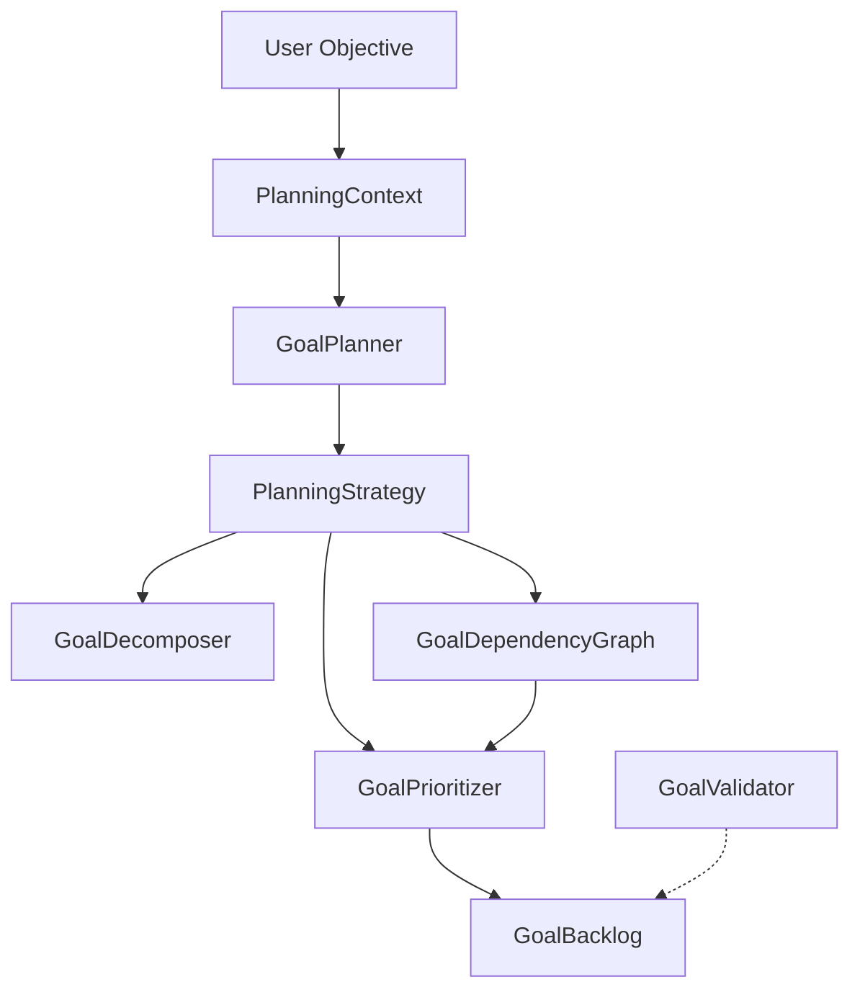
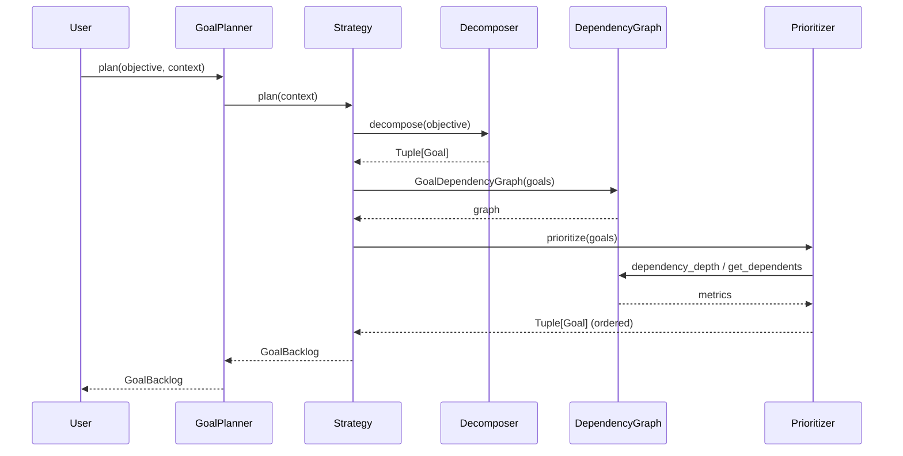
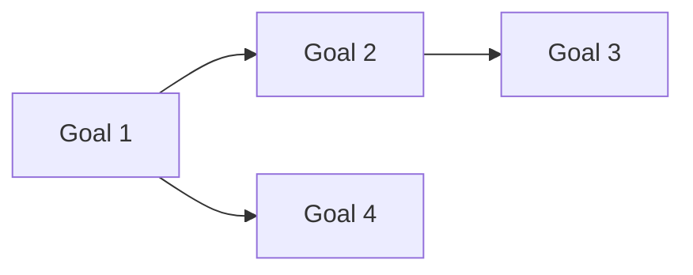

# Planner System — Sprint 3

## Overview

The Planner subsystem decomposes high-level objectives into structured, prioritized backlogs of Goals. It follows a **strategy pattern** architecture — algorithms are pluggable, deterministic by default, and designed for future LLM-based implementations.

## Architecture



### Planning Flow



## Component Reference

### GoalPlanner

```python
class GoalPlanner:
    def __init__(self, strategy: str | PlanningStrategy = "rule_based") -> None
    def plan(self, objective: str, context: PlanningContext | None = None) -> GoalBacklog
    def plan_to_goals(self, objective: str) -> Tuple[Goal, ...]
```

Public entry point. Delegates to a `PlanningStrategy`. Backward-compatible via `plan_to_goals()`.

### PlanningContext

```python
@dataclass
class PlanningContext:
    objective: str
    engineering_memory: Any = None
    repository_state: Sequence[Goal] = field(default_factory=list)
    active_branch: str = ""
    available_tools: List[str] = field(default_factory=list)
    previous_attempts: int = 0
    current_backlog: Optional[GoalBacklog] = None
    metadata: Dict[str, Any] = field(default_factory=dict)
```

Carries all information a planner may need. Extensible via `metadata` dict.

### GoalDecomposer

```python
class GoalDecomposer:
    def decompose(self, objective: str, goal_id_prefix: str = "plan") -> Tuple[Goal, ...]
```

Splits an objective into sub-goals by:
- Newlines → one goal per line
- " and " conjunctions → split into individual goals
- Bullet points / numbered lists → stripped

Additionally infers:
- `estimated_complexity` from keywords (simple→XS, complex→L, etc.)
- `tags` from keywords (auth→security, test→tests, etc.)

### GoalDependencyGraph

```python
class GoalDependencyGraph:
    def __init__(self, goals: Tuple[Goal, ...]) -> None
    def has_cycle(self) -> bool
    def find_cycle(self) -> List[str]
    def topological_sort(self) -> Tuple[Goal, ...]
    def get_unblocked(self) -> Tuple[Goal, ...]
    def get_dependents(self, goal_id: str) -> Tuple[str, ...]
    def dependency_depth(self, goal_id: str) -> int
```

Builds a directed graph from each Goal's `depends_on`. Implements:
- **Cycle detection** via DFS coloring
- **Topological sort** via Kahn's algorithm
- **Dependency depth** for prioritization weighting



### GoalPrioritizer

```python
class GoalPrioritizer:
    def __init__(self, graph: GoalDependencyGraph) -> None
    def prioritize(self, goals: Tuple[Goal, ...]) -> Tuple[Goal, ...]
```

Deterministic sorting by (in order):
1. Priority (lower value = higher urgency)
2. Dependency depth (deeper = earlier)
3. Number of dependents (more dependents = higher impact)
4. Complexity risk (simpler = earlier)
5. Input order (stable tiebreaker)

### PlanningStrategy (ABC)

```python
class PlanningStrategy(ABC):
    @abstractmethod
    def plan(self, context: PlanningContext) -> GoalBacklog: ...
```

### RuleBasedPlanningStrategy

Default implementation. Uses:
- `GoalDecomposer` to split the objective
- `GoalDependencyGraph` for cycle detection
- `GoalPrioritizer` for ordering

### PlannerFactory

```python
class PlannerFactory:
    @classmethod
    def create(cls, strategy_name: str = "rule_based") -> PlanningStrategy
    @classmethod
    def register(cls, name: str, strategy_cls: type[PlanningStrategy]) -> None
```

| Strategy | Class | Description |
|----------|-------|-------------|
| `rule_based` | `RuleBasedPlanningStrategy` | Deterministic, keyword-based |

## Extension Points

| Point | Interface | Example |
|-------|-----------|---------|
| Planner strategy | `PlanningStrategy.plan(context)` | `LLMPlanningStrategy` |
| Custom decomposer | Subclass `GoalDecomposer` | `SemanticGoalDecomposer` |
| Custom prioritizer | Subclass `GoalPrioritizer` | `MLGoalPrioritizer` |
| Custom validator | `validate_backlog()` | Custom rules |
| Factory registration | `PlannerFactory.register()` | `"llm" → LLMPlanningStrategy` |

## Goal Fields (Updated Sprint 3)

```python
@dataclass(frozen=True)
class Goal:
    id: str
    title: str
    description: str
    success_criteria: str
    priority: GoalPriority | int = GoalPriority.MEDIUM
    status: GoalStatus | str = GoalStatus.TODO
    depends_on: Tuple[str, ...] = tuple()           # Sprint 3
    estimated_complexity: str = "M"                  # Sprint 3 (XS/S/M/L/XL)
    tags: Tuple[str, ...] = tuple()                  # Sprint 3
```

### estimated_complexity

| Value | Meaning | Example Keywords |
|-------|---------|-----------------|
| XS | Extra Small | simple, tiny, quick, minor |
| S | Small | easy, trivial, cosmetic |
| M | Medium | (default) |
| L | Large | large, complex, major |
| XL | Extra Large | huge, massive, architect |

### Tags

Valid values: `backend`, `frontend`, `tests`, `docs`, `security`, `performance`, `devops`, `infra`, `refactor`, `bugfix`, `feature`, `research`

### depends_on

Tuple of Goal IDs that must be completed before this Goal can start. Creates a dependency graph.

## GoalValidator (Enhanced)

```python
def validate_goal(goal: Goal, existing_goals: Sequence[Goal] = ()) -> None
def validate_backlog(goals: Tuple[Goal, ...]) -> None
```

`validate_backlog` checks:
- Empty backlog
- Duplicate goal titles
- Dependency cycles
- Non-existent dependency references

## Integration with GoalManager

```python
from clawai.goals import GoalPlanner, GoalManager

planner = GoalPlanner(strategy="rule_based")
ctx = PlanningContext(objective="Fix bugs\nAdd tests")
backlog = planner.plan("Fix bugs\nAdd tests", context=ctx)

mgr = GoalManager(repository=EngineeringMemory())
for goal in backlog.goals:
    mgr.add_goal(goal)
mgr.create_backlog()
```

## Test Coverage

| Component | Tests | Scope |
|-----------|-------|-------|
| `Goal` (new fields) | 8 | depends_on, complexity, tags |
| `GoalDependencyGraph` | 7 | cycle, topological, unblocked, depth |
| `GoalPrioritizer` | 2 | basic, input order |
| `GoalDecomposer` | 9 | empty, lines, unicode, emoji, tags, complexity |
| `PlanningContext` | 1 | defaults |
| `PlanningStrategy` | 2 | basic, empty |
| `PlannerFactory` | 3 | default, unknown, register |
| `validate_backlog` | 4 | empty, dup, invalid dep, cycle |
| `GoalComplexity` | 2 | values, str |
| `GoalPlanner` (refactored) | 9 | backlog return type |
